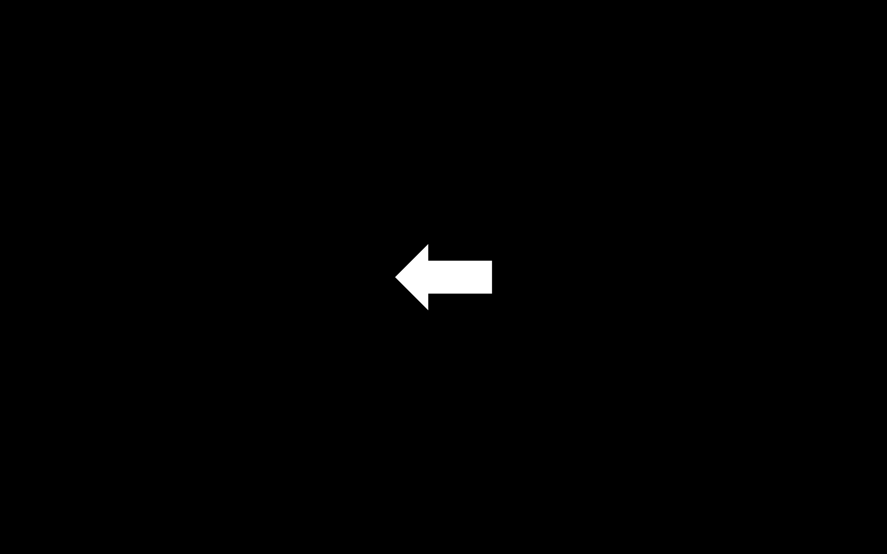
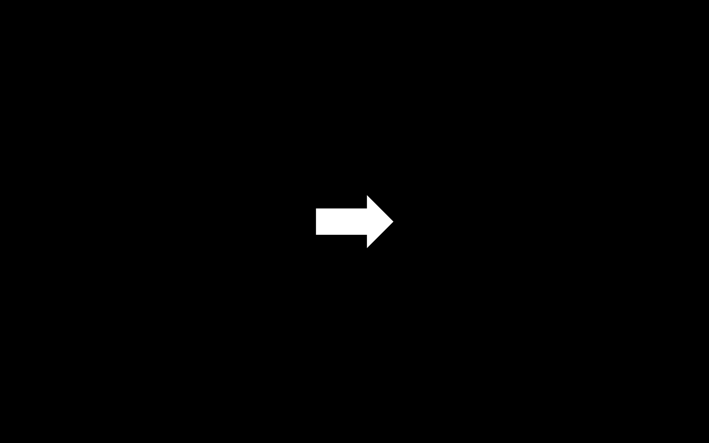
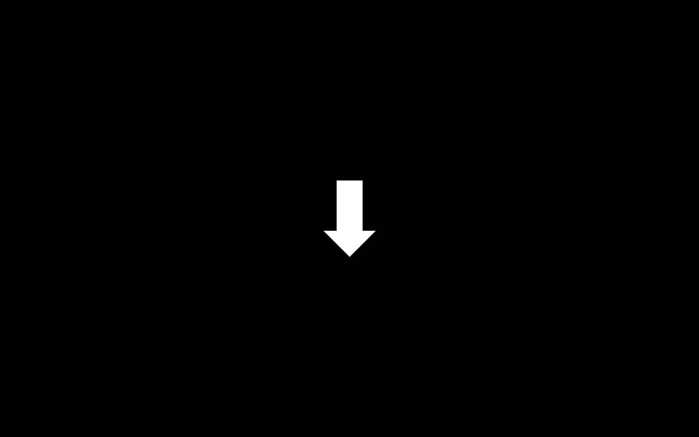
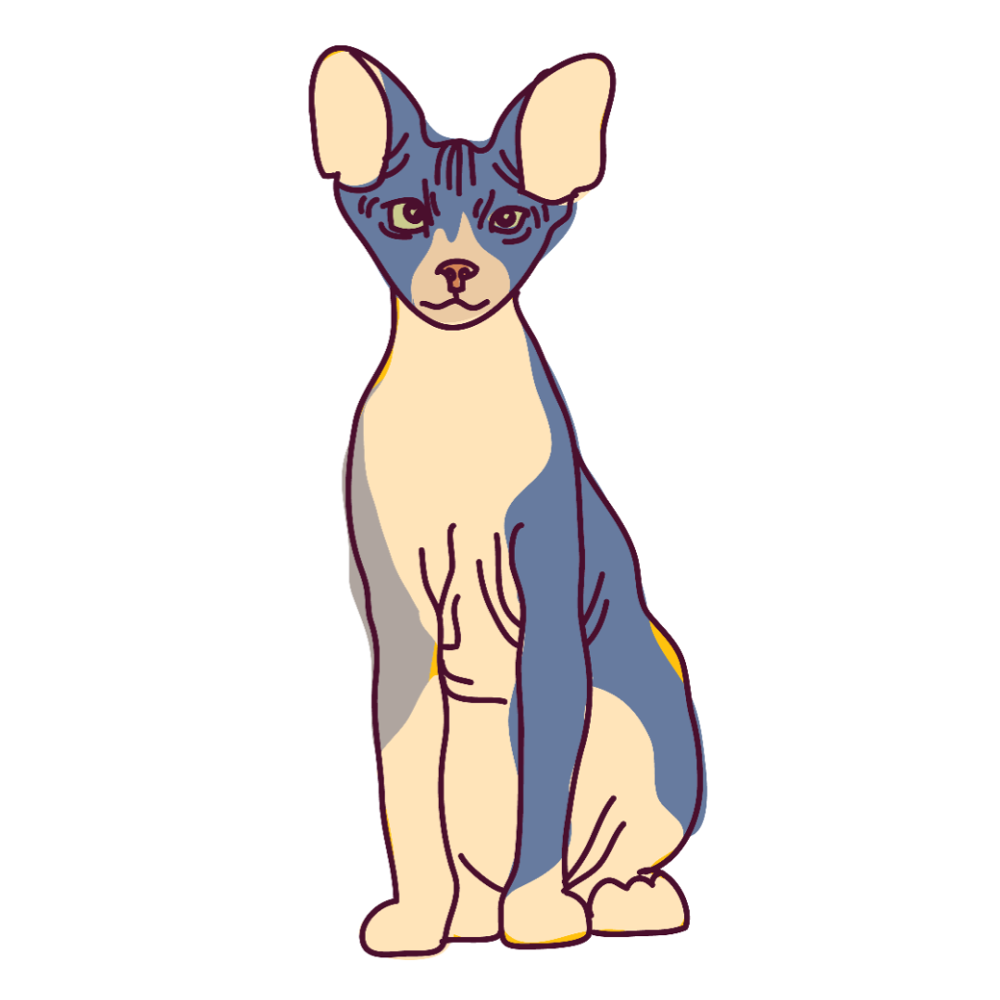

# Psychopy_priming_experiment
A priming experiment meets finding Waldo.

## Motivation
1. Learning psychopy and refreshing my memory of python.
2. Project work for a Computer Programing university course.

## Concept
- The main idea is a simple priming experiment masked as a "find the hidden object" game.
- The subject is presented with a pair of primes; the first is an arrrow pointing left or right and the second is an arrow pointing up and down.
- The arrows prime the location of the hidden object:
	- left + up -> upper left quarter of the image
	- left + down -> bottom left quarter of the image
	- right + up -> upper right quarter of the image
	- right + down -> bottom right quarter of the image
- The primes can be congruent, as in exactly matching the location of the object, or incongruent, as in the object is located in the opposite direction of the primes.
- The primes, images, and congruency are randomly chosen.
- Each image is presented for a max of 30 seconds, unless the subject finds the object before the time limit, where they are expected to press the 'space' key to move to the next image.

## Sample Images
### fixation cross
 

### Arrows

### Berus
- the hidden object too be found
- the object was AI generated by my friend
- I named him Berus becaus he looks like a charachter with the same name in dragon ball.

### Sample Background
- backgrounds were found on Pinterest by searching for 'finding waldo' backgrounds

